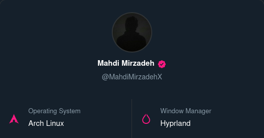

# unixcard

<p align="center"></p>

A web-based tool to create and customize X.com-style system cards showcasing your Linux setup and configuration.

## What It Does

This application mirrors Twitter/X.com's "About your account" details page, adapted for Linux enthusiasts. Instead of displaying account creation dates and verification badges, it showcases Linux-specific information like distro choice, desktop environment, shell, and kernel version.

The app provides a real-time preview as you customize your card. All data is automatically saved to your browser.

## Features

- **Real-time preview** of your card as you customize it
- **13 Linux distros** with dedicated icons
- **Multiple themes**: Dim, Light, Lights Out
- **6 accent colors** to personalize your card
- **Profile integration**: Fetches your X.com profile picture
- **Verification badge** option
- **Copy to clipboard** functionality
- **Download as PNG** to share your card
- **Desktop environments/window managers** support
- **Multiple shells and terminals** to choose from
- **Responsive design** that works on all modern browsers

## Technology

- **Frontend**: Vanilla HTML, CSS, and JavaScript (no frameworks)
- **Data Storage**: Browser localStorage for client-side persistence
- **Image Export**: html2canvas library for PNG downloads
- **Icons**: Custom SVG icons that adapt to theme and accent colors

## File Structure

```
├── html2canvas.min.js   # PNG export library
├── image.png            # Open Graph image (used in social media previews)
├── index.html           # Application structure
├── style.css            # All styling and theming
├── script.js            # All functionality and logic
└── README.md            # This file
```

## How It Works

The application is entirely client-side with no backend dependencies. All user input is:
- Displayed in real-time in the preview
- Saved to browser localStorage automatically
- Persisted across browser sessions

The icon system is extensible - new Linux distros or desktop environments can be added by extending the icon objects in `script.js`.

## Browser Compatibility

Works in all modern browsers supporting:
- CSS Grid
- Fetch API
- SVG rendering
- ES6+ JavaScript
